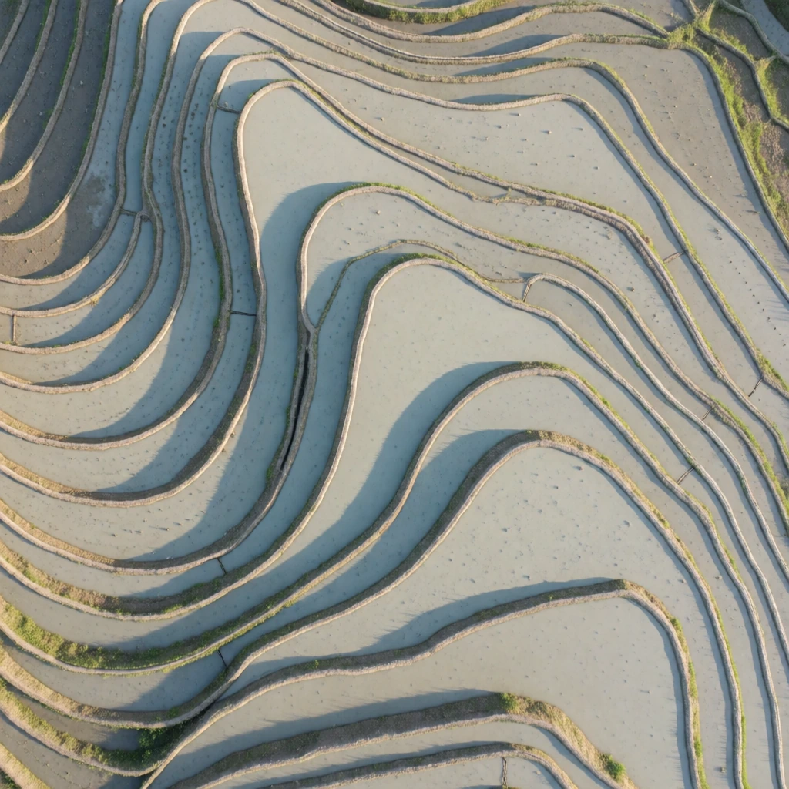
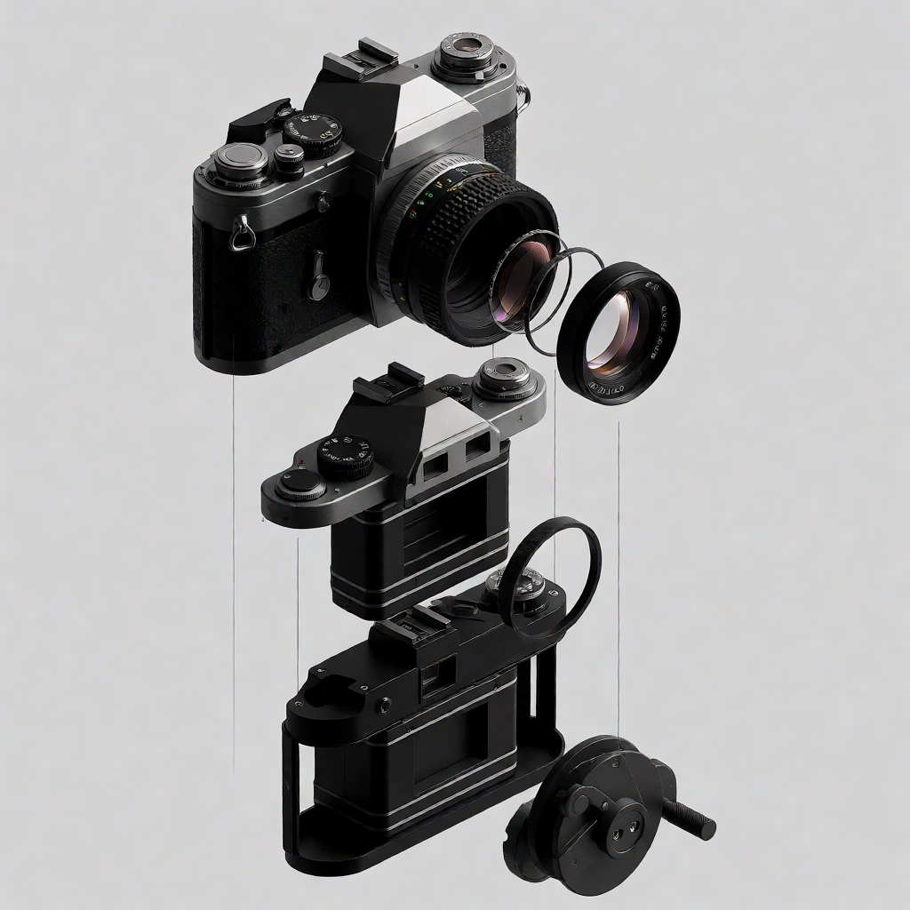
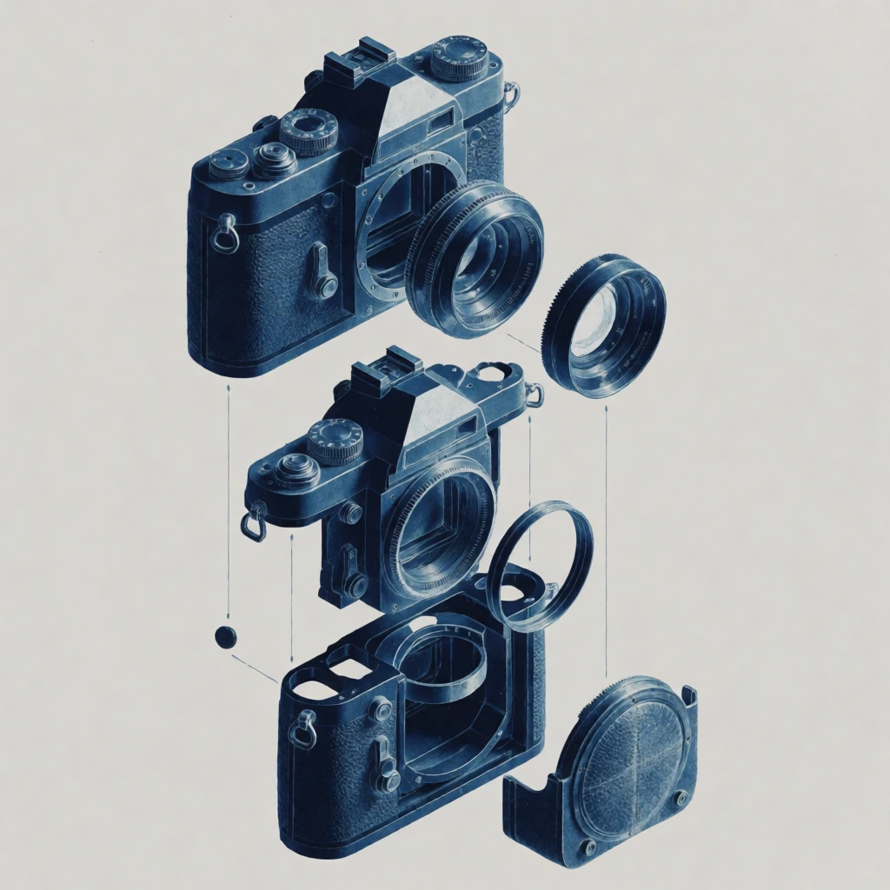
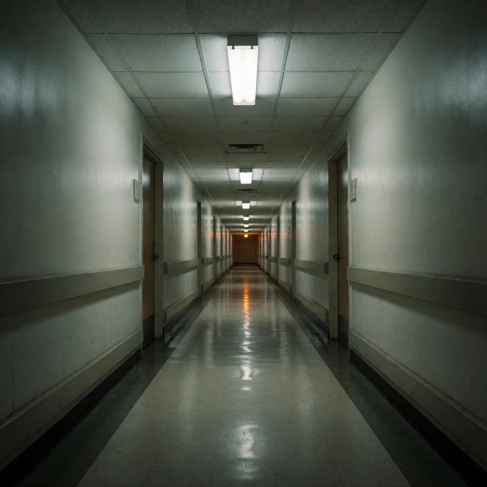
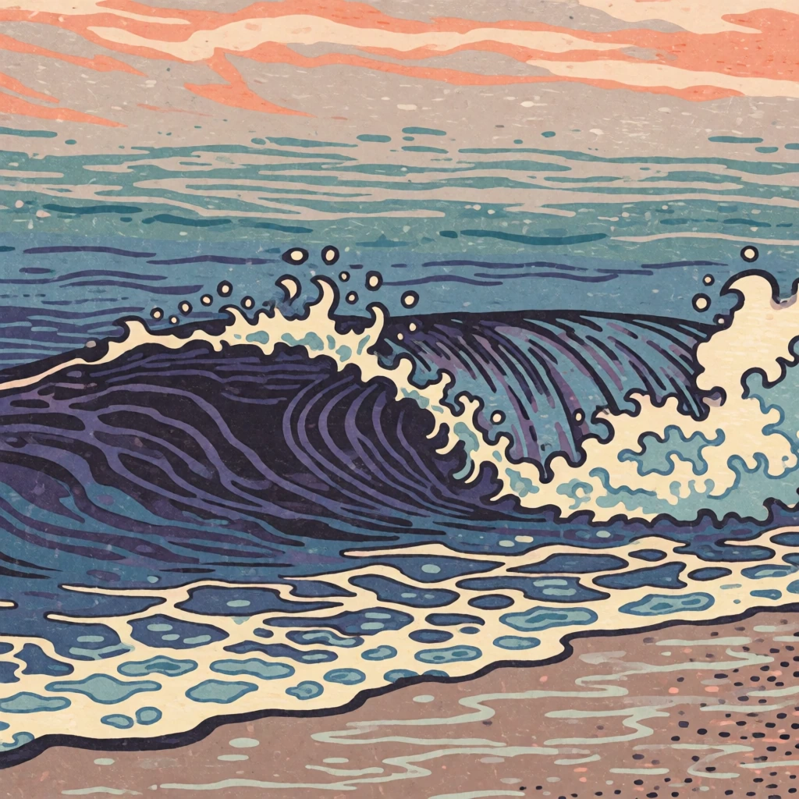
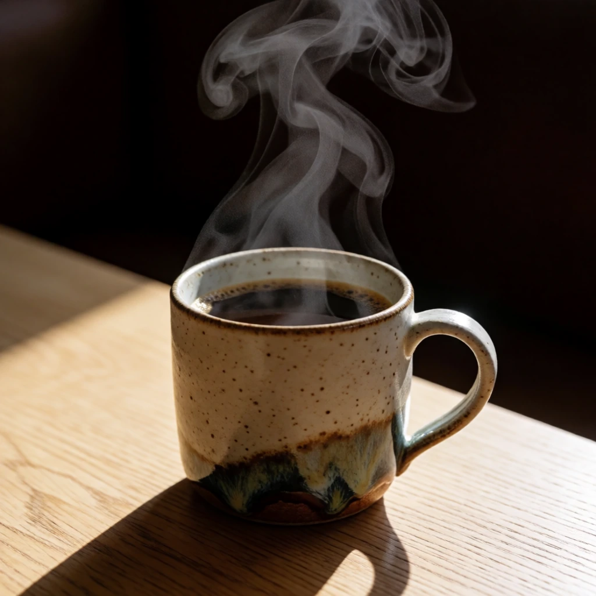
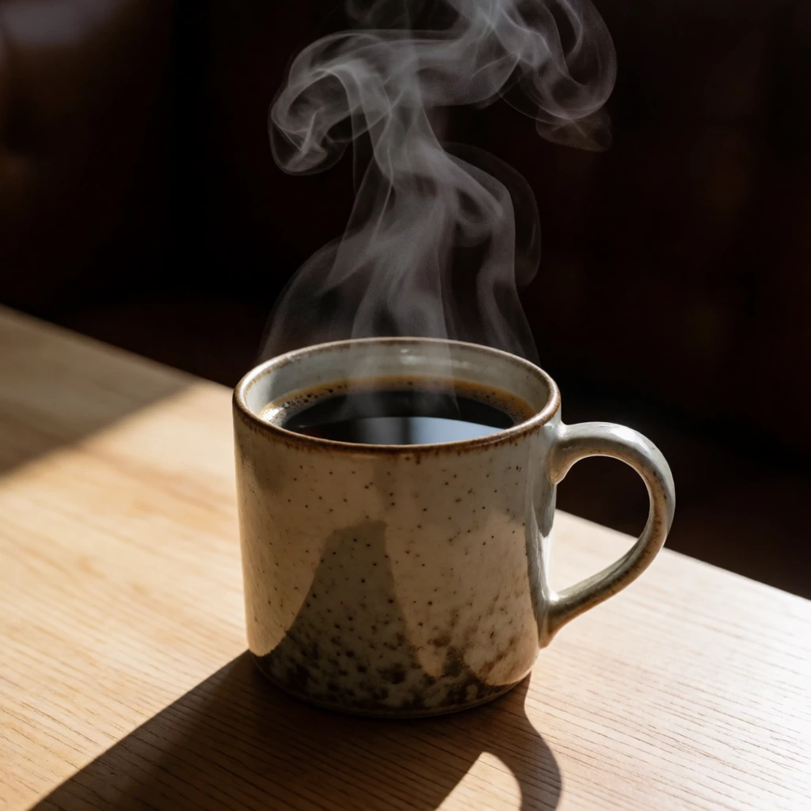
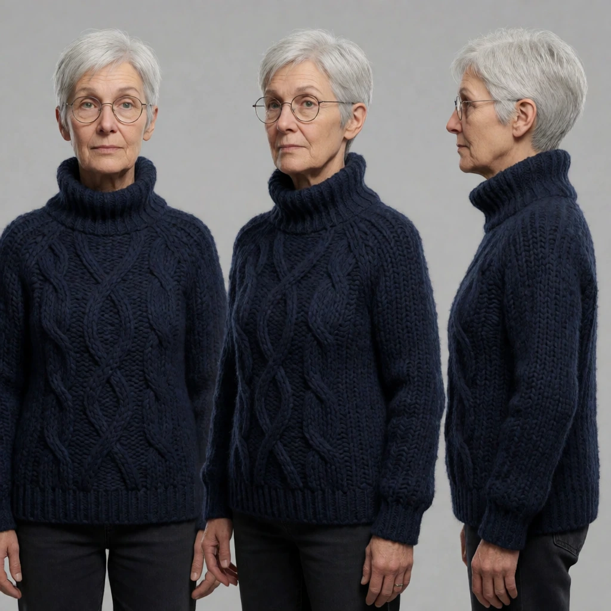
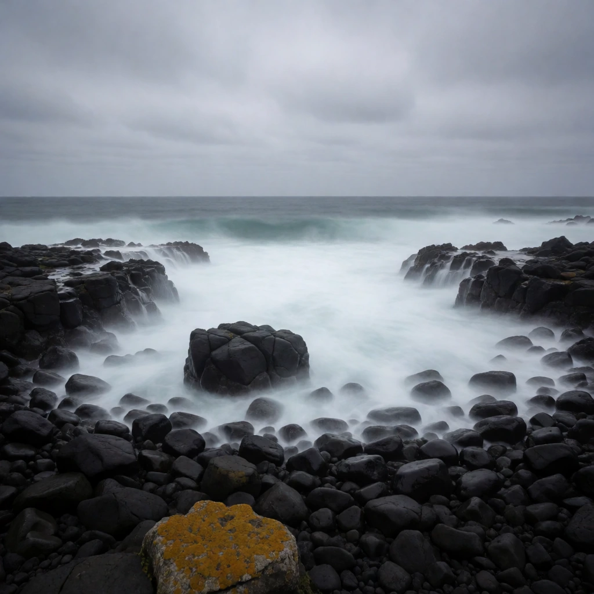
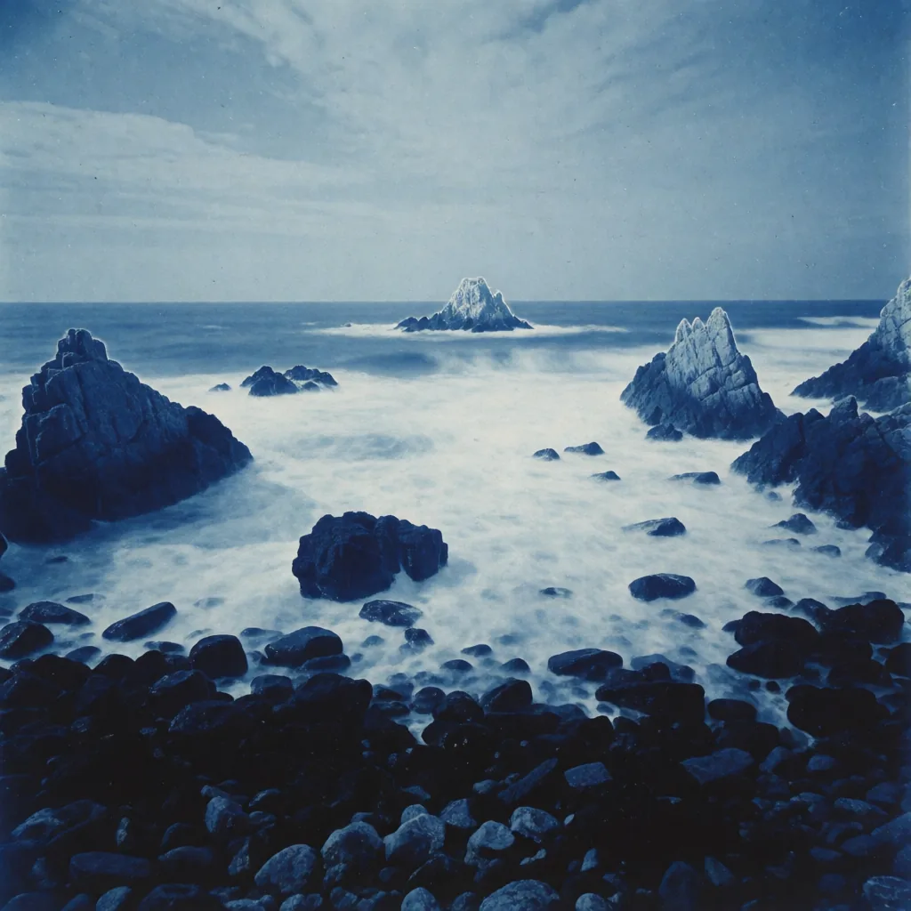

<h1 align="center">same-frame</h1>

<p align="center">Re-render an image you already have — new light, new palette, new medium — with the composition provably unchanged.<br>
<b>Five recipes that were measured. Two requests it refuses, with the images proving why.</b></p>

<p align="center">




</p>

An agent skill for Claude Code and Codex, built on one measurement:

> **Krea 2 changes how a scene is rendered. It does not change what is in the scene.**

Every strength value here is the one that produced the paired image, not a suggested starting point. The working band is **0.50–0.60** and it is narrower than it looks.

---

## The five that work

| | Recipe | Changes | Strength |
|---|---|---|---|
|  | `relight-hard-sun` | overcast → hard low-angle sun, shadows cast on command | 0.55 |
|  | `relight-single-source` | cold fluorescents → one warm source, everything else into shadow | 0.50 |
|  | `medium-gouache` | photograph → gouache, every contour holds position | 0.60 |
|  | `palette-shift` | recolour without moving a single keyblock outline | 0.55 |
|  | `medium-cyanotype` | diagram → cyanotype blueprint, spacing preserved | 0.60 |

```bash
python3 same_frame.py --image photo.jpg --recipe medium-gouache \
  --slot subject="these terraced fields" --slot contour="terrace contour" \
  --out out.png
```

The slots are not decoration. Every kept edit named the thing that must not move, in the prompt, explicitly — *"every terrace contour stays in exactly the same position"*, *"the rock placement, horizon line and framing identical"*. Vague sources drifted, so the script will not run a recipe with an unfilled slot.

## The two it refuses

Most prompt collections tell you everything works. These two were run, they failed, and the failures are in this repo.

<table>
<tr><td width="50%">

**Remove or add an object → refused**

 

Asked at strength 0.5 to remove the steam and let the surface go mirror-flat. The steam came back. Adding snow to a coastline returned the same coastline slightly cooler; darkening a sky returned the same sky.

Turning strength up does not fix this — it replaces your subject instead. **Use inpainting with a mask.**

</td><td width="50%">

**Same character in a new scene → refused**

 

At 0.72 the scene is genuinely new and the person is not the same; only the sweater and the palette carried over. At 0.45 the face survives but the source composition comes with it — a three-view studio sheet became the same three views at a harbour.

There is no value between them that gives one without the other. **Train a LoRA.**

</td></tr>
</table>

```
$ python3 same_frame.py --image mug.png --prompt "Remove the steam entirely." --strength 0.5

Refusing: Krea 2 does not add or remove objects. Refuse and say why.
  (triggered by 'remove the' — use --force if this read you wrong)

  This was already run at strength 0.5, seed 1499506316:
    asked for: Remove the steam entirely and let the coffee surface go still and mirror-flat.
    got:       The steam came back.
    see:       examples/refuse-removal-after.webp

  Instead: Use an inpainting model with a mask. This is a segmentation problem,
           not a strength problem.
```

Both refusals are overridable with `--force`. Being certain about someone else's use case is its own failure mode. The default is the measurement.

## The one that only half works




`medium-cyanotype` against a **photograph**, strength 0.6, seed 2065751023. Every rock held its exact position and the palette went Prussian blue — and there is no line work anywhere. It is a blue-toned photograph, not a blueprint.

This is the same rule one level down. Gouache transfers onto a photograph because gouache is still continuous tone; the model is changing surface, not structure. Outlines are content a photograph does not contain, and the model will not invent them any more than it will invent an object you asked it to add.

<br clear="left">

**Continuous tone → continuous tone works. Anything → line work needs a line-art source.** The script warns before spending the request.

## Install

**Claude Code**

```bash
git clone https://github.com/sjh9714/same-frame ~/.claude/skills/same-frame
```

**Codex**

```bash
git clone https://github.com/sjh9714/same-frame ~/.codex/skills/same-frame
```

**Standalone** — the script has no dependencies beyond the standard library:

```bash
git clone https://github.com/sjh9714/same-frame && cd same-frame
printf 'FAL_KEY=%s\n' 'YOUR_KEY' > .env && chmod 600 .env   # do not paste keys into a chat
python3 same_frame.py --list
```

Get a key at [fal.ai](https://fal.ai/dashboard/keys). About **$0.008 per megapixel** — roughly eight tenths of a cent for a 1024×1024 edit. `.env` is gitignored.

## Reproducing a result

The endpoint is deterministic: two runs at the same seed, strength, prompt and input bytes came back differing on **0 of 1,048,576 pixels**.

So if a re-run looks different, the input changed. This bites in one specific way — feeding a lossy WebP copy of the PNG an edit was originally made from moved the result by **17.0/255** mean per-pixel. Composition, palette and medium all returned; brush texture did not. Keep the original file. For image-to-image, the seed alone does not reproduce a generation; the seed *and the exact input bytes* do.

## What is not verified

The band is a **Krea 2 Turbo** measurement, on roughly square images. Whether 0.55 means the same thing on Krea 2 non-turbo, on another model, or at 16:9 is untested — re-measure before carrying the number over. Five recipes and two refusals is a small n; it is the honest n.

## Where this came from

Extracted from [awesome-krea-2](https://github.com/sjh9714/awesome-krea-2) — 114 generations, 85 kept, 29 cut, every seed recorded. The refusals are two of the cuts.

MIT for the code and the prompts. The example images are Krea 2 Turbo output, produced under the Krea 2 Community License, presented as model output rather than as photographs or artwork. The safety checker was enabled on every request.
