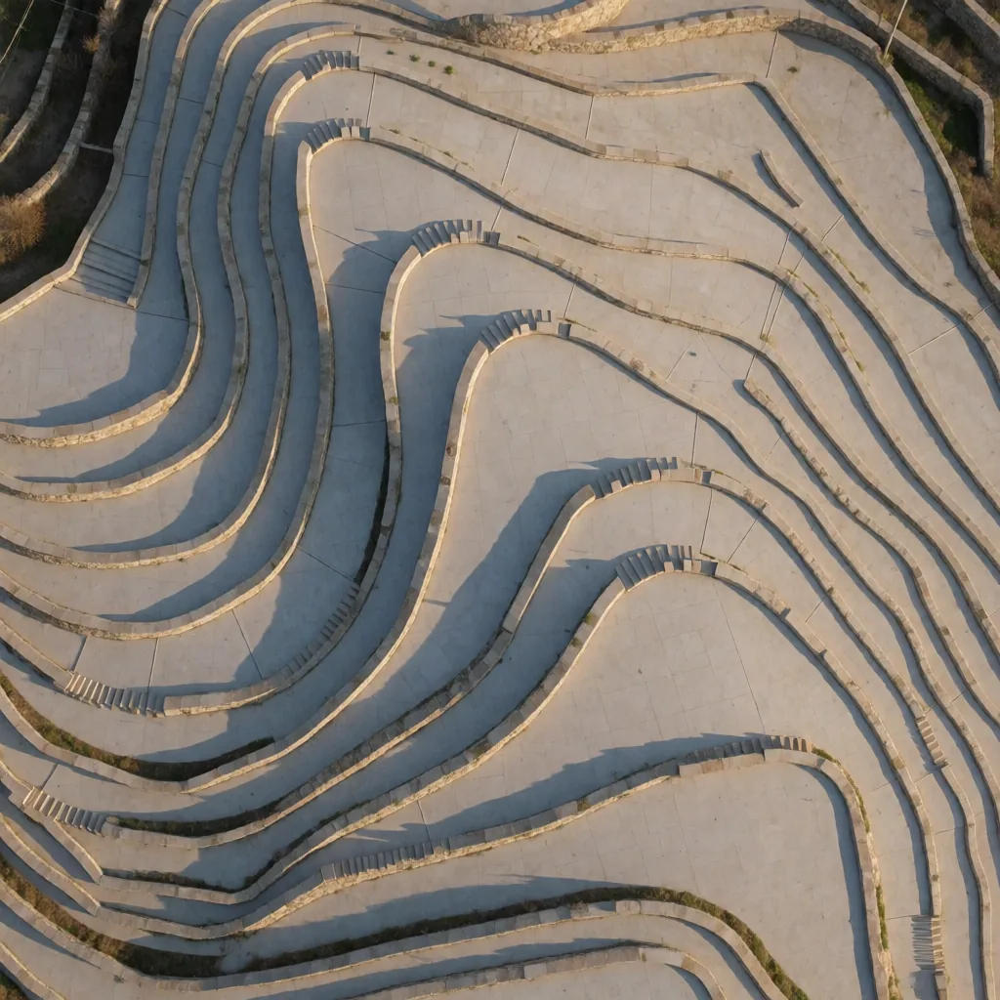

<h1 align="center">same-frame</h1>

<div align="center">

[](https://github.com/sjh9714/same-frame/stargazers)
[](https://sjh9714.github.io/same-frame/)
[](LICENSE)

**Geometry is locked. Material is not.**

An agent skill for Claude Code and Codex.
**5 Krea 2 re-render recipes · 2 hold outside their own pair · 2 partial · 1 narrow · 2 refusals · every strength and seed recorded**

[English](README.md) | [中文](README_ZH.md) · [**Before/after gallery →**](https://sjh9714.github.io/same-frame/)

</div>

<p align="center">


</p>

<p align="center"><sub>Same corridor, same vanishing point, same tiles. Same terraces, same contours.<br>
<a href="https://sjh9714.github.io/same-frame/">See every pair edge to edge →</a></sub></p>

Every strength value is the one that produced the paired image, not a suggested starting point. The working band is **0.50–0.60** and it is narrower than it looks.

The reason this repo exists in this shape: a recipe that only works on the pair it was derived from is a screenshot of one result, not a recipe. So each of the five was run again against an unrelated source, and **the tier column below is that result rather than an estimate**.

---

## The five

| Recipe | Tier | Changes | Strength | Holds up on |
|---|---|---|---|---|
| `medium-gouache` | **holds** | photograph → gouache, contours in place | 0.60 | anything, both directions |
| `palette-shift` | **holds** | recolour to three named colours | 0.55 | anything; drop the "flat colour field" clause on photos |
| `relight-hard-sun` | **conditional** | overcast → hard low sun with cast shadows | 0.55 | hard dry materials — tested twice |
| `relight-single-source` | narrow | one warm source, everything else into shadow | 0.50 | enclosures with no live window |
| `medium-cyanotype` | narrow | → white line work on Prussian blue | 0.60 | line-art sources only |

```bash
python3 same_frame.py --image photo.jpg --recipe medium-gouache \
  --slot subject="these terraced fields" --slot contour="terrace contour" \
  --out out.png
```

The slots are not decoration. Every kept edit named the thing that must not move, in the prompt, explicitly — *"every terrace contour stays in exactly the same position"*, *"the rock placement, horizon line and framing identical"*. Vague sources drifted, so the script will not run a recipe with an unfilled slot. It also warns you before spending a request on a `partial` or `narrow` recipe.

## What "material is not locked" means

<table>
<tr><td width="33%" align="center"><br><sub>wet rice terraces</sub></td>
<td width="33%" align="center"><br><sub><b>after relight-hard-sun</b></sub></td>
<td width="34%">

`relight-hard-sun` on wet rice terraces, strength 0.55, seed 232270180. Every contour stayed in position and the hard low sun and long shadows arrived exactly as asked.

And the paddies became **dry stone amphitheatre steps**. The water is gone. The vegetation is gone.

Hard light forces the model to re-derive how every surface responds, and a surface that reads as wet under flat light gets re-rendered as dry under hard light. It was invisible on the coastline this recipe came from, because basalt is dry either way.

**Check what things are made of in the output, not just where they are.**

</td></tr>
</table>

## The two it refuses outright

Most prompt collections tell you everything works. These two were run, they failed, and the failures are in this repo.

<table>
<tr><td width="50%">

**Remove or add an object → refused**

 

Asked at strength 0.5 to remove the steam and let the surface go mirror-flat. The steam came back. Adding snow to a coastline returned the same coastline slightly cooler; darkening a sky returned the same sky.

Turning strength up does not fix this — it replaces your subject instead. **Use inpainting with a mask.**

</td><td width="50%">

**Same character in a new scene → refused**

 

At 0.72 the scene is genuinely new and the person is not the same; only the sweater and the palette carried over. At 0.45 the face survives but the source composition comes with it — a three-view studio sheet became the same three views at a harbour.

There is no value between them that gives one without the other. **Train a LoRA.**

</td></tr>
</table>

```
$ python3 same_frame.py --image mug.png --prompt "Remove the steam entirely." --strength 0.5

Refusing: Krea 2 does not add or remove objects. Refuse and say why.
  (triggered by 'remove the' — use --force if this read you wrong)

  This was already run at strength 0.5, seed 1499506316:
    asked for: Remove the steam entirely and let the coffee surface go still and mirror-flat.
    got:       The steam came back.
    see:       examples/refuse-removal-after.webp

  Instead: Use an inpainting model with a mask. This is a segmentation problem,
           not a strength problem.
```

Both refusals are overridable with `--force`. Being certain about someone else's use case is its own failure mode. The default is the measurement.

## The other two limits, with the images

**Line work cannot be invented.** `medium-cyanotype` against a photograph (seed 2065751023) held every rock position and went Prussian blue, and produced no line work at all — a blue-toned photograph, not a blueprint ([`limit-cyanotype-on-photo.webp`](examples/limit-cyanotype-on-photo.webp)). Outlines are content a photograph does not contain, and the model will not invent them any more than it will invent an object you asked it to add. Continuous tone → continuous tone works; anything → line work needs a line-art source. It runs fine in the other direction: gouache on a line-art diagram is the cleanest result in this repo.

**Relighting adds light; it does not take light away.** `relight-single-source` outdoors (seed 1114110846) held the composition and *"everything nearer falling into shadow"* did not happen at all ([`limit-single-source-outdoors.webp`](examples/limit-single-source-outdoors.webp)). Run again on an attic workshop with a skylight (seed 1269377144), it got half way: the work lamps came on and the corners went dark, and **the skylight stayed exactly as bright as before** ([`limit-single-source-daylight.webp`](examples/limit-single-source-daylight.webp)). It also produced two lamps where the prompt said one.

So "interiors only" was too generous, and the real rule is sharper: an existing light source is *content*, switching it off is *removal*, and removal is the thing this model will not do — the same wall as the object-removal refusal, one level down. Use it on corridors, tunnels and windowless rooms. A room with a live window keeps its window.

**And the material caveat is now a tested precondition, not a guess.** `relight-hard-sun` was marked partial off a single failure. Run on a board-formed concrete stairwell (seed 561284942) it held completely — same treads, same handrail, same skylight, a hard low sun with a clean diagonal shadow down the right wall, and concrete that stayed concrete ([`ok-relight-on-concrete.webp`](examples/ok-relight-on-concrete.webp)). The wet-terrace drift was about the material, not the recipe.

## Install

**Claude Code**

```bash
git clone https://github.com/sjh9714/same-frame ~/.claude/skills/same-frame
```

**Codex**

```bash
git clone https://github.com/sjh9714/same-frame ~/.codex/skills/same-frame
```

**Standalone** — no dependencies beyond the standard library:

```bash
git clone https://github.com/sjh9714/same-frame && cd same-frame
printf 'FAL_KEY=%s\n' 'YOUR_KEY' > .env && chmod 600 .env   # do not paste keys into a chat
python3 same_frame.py --list
```

Get a key at [fal.ai](https://fal.ai/dashboard/keys). About **$0.008 per megapixel** — roughly eight tenths of a cent for a 1024×1024 edit. `.env` is gitignored.

## Reproducing a result

The endpoint is deterministic: two runs at the same seed, strength, prompt and input bytes came back differing on **0 of 1,048,576 pixels**.

So if a re-run looks different, the input changed. This bites in one specific way — feeding a lossy WebP copy of the PNG an edit was originally made from moved the result by **17.0/255** mean per-pixel. Composition, palette and medium all returned; brush texture did not. Keep the original file. For image-to-image, the seed alone does not reproduce a generation; the seed *and the exact input bytes* do.

## What is not verified

The band is a **Krea 2 Turbo** measurement on roughly square images. Whether 0.55 means the same thing on Krea 2 non-turbo, on another model, or at 16:9 is untested — re-measure before carrying the number over.

Each recipe was generalisation-tested against exactly **one** unrelated source. That is enough to separate "works" from "only works on what it came from"; it is not enough to map where a `partial` recipe stops. Five recipes, one out-of-pair run each, is a small n. It is the honest n.

## Where this came from

Extracted from [awesome-krea-2](https://github.com/sjh9714/awesome-krea-2) — 114 generations, 85 kept, 29 cut, every seed recorded. The two refusals are two of the cuts.

MIT for the code and the prompts. The example images are Krea 2 Turbo output, produced under the Krea 2 Community License, presented as model output rather than as photographs or artwork. The safety checker was enabled on every request.
