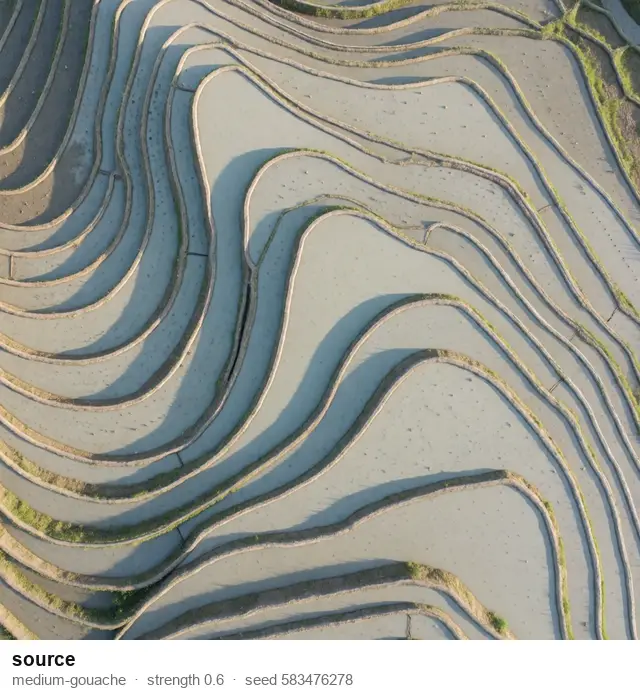
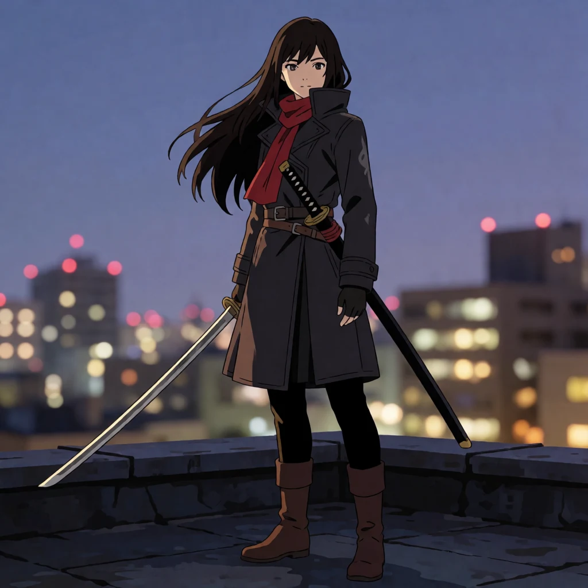
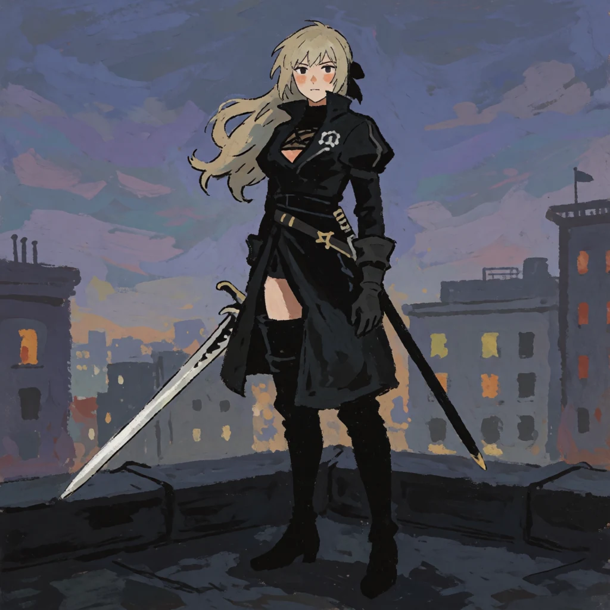
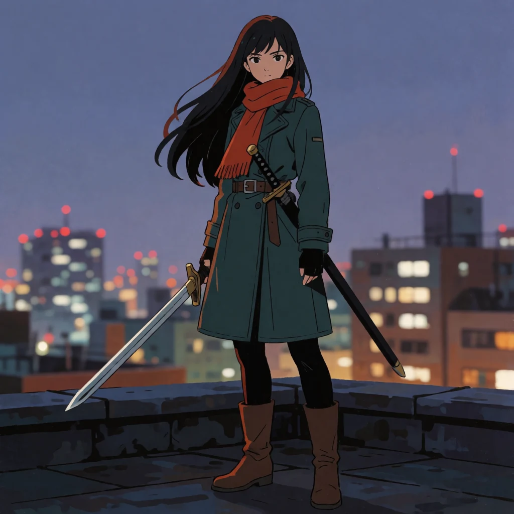

<h1 align="center">same-frame</h1>

<div align="center">

[](https://github.com/sjh9714/same-frame/stargazers)
[](https://sjh9714.github.io/same-frame/)
[](LICENSE)

**几何被锁住，材质没有。**

**5 个 Krea 2 图生图配方 · 每个 strength 和 seed 都是生成下面那张图时用的实际数值**

每个配方都在并非其出处的素材上重跑过一次；哪里失效，就有一张失效的图。另有 2 个请求它直接拒绝执行，并附上此前失败的那次运行。

可以当一行命令的脚本用，也可以作为 agent skill 放进 Claude Code 或 Codex。

[English](README.md) | [中文](README_ZH.md) · [**前后对比画廊 →**](https://sjh9714.github.io/same-frame/)

</div>

<p align="center">

</p>

<p align="center"><sub>实际输出，strength 和 seed 都印在每一帧下面。<br>
<a href="https://sjh9714.github.io/same-frame/">逐对并排查看 →</a></sub></p>

这里每个 strength 都是**实际产出配对图像的那个值**，不是建议起点。可用区间是 **0.50–0.60**，比看上去要窄。

这个仓库之所以是现在这个形状：一个只在自己来源图对上成立的配方，是一张结果截图，不是配方。所以五个配方都在**它们并非由之推导出来的素材**上重跑了一遍，下面的 tier 一栏是那次重跑的结果，不是估计。

---

## 五个配方

| 配方 | Tier | 改变什么 | Strength | 在什么素材上成立 |
|---|---|---|---|---|
| `medium-gouache` | partial | 照片 → 水粉，轮廓保持原位 | 0.60 | 物体可以，人物不行 — 见下文 |
| `palette-shift` | **holds** | 换成三个指定颜色 | 0.55 | 任何素材；照片素材请删掉 "flat colour field" 那句 |
| `relight-hard-sun` | **conditional** | 阴天 → 低角度硬光并投出长影 | 0.55 | 本身就硬且干的材质，已在第二张无关素材上验证 |
| `relight-single-source` | narrow | 单一暖光源，其余落入阴影 | 0.50 | 没有现存自然光的封闭空间 |
| `medium-cyanotype` | partial | → 蓝晒，蓝图形式或照片形式 | 0.60 | 线稿，以及平面化的照片主体 |

```bash
python3 same_frame.py --image photo.jpg --recipe medium-gouache \
  --slot subject="these terraced fields" --slot contour="terrace contour" \
  --out out.png
```

那些 slot 不是装饰。所有保留下来的编辑都在 prompt 里**明确点名了不许移动的东西**——"every terrace contour stays in exactly the same position"、"the rock placement, horizon line and framing identical"。含糊的写法会漂移，所以脚本在 slot 没填满时不会执行。遇到 `partial` 或 `narrow` 的配方，它会在花掉这次请求之前先警告你。

## "材质没有被锁住" 是什么意思

<table>
<tr><td width="33%" align="center"><br><sub>湿的水稻梯田</sub></td>
<td width="33%" align="center"><br><sub><b>relight-hard-sun 之后</b></sub></td>
<td width="34%">

`relight-hard-sun` 跑在湿的水稻梯田上，strength 0.55，seed 232270180。每条等高线都留在原位，低角度硬光和长影也完全按要求出现了。

然后水田变成了**干燥的石砌阶梯**。水没了，植被也没了。

硬光会逼模型重新推导每个表面如何响应光照，而一个在平光下读作"湿"的表面，在硬光下会被重渲染成"干"。这个问题在配方来源的那张海岸线上看不出来，因为玄武岩本来就是干的。

**验收时要看东西是什么做的，而不只是看它在哪。**

</td></tr>
</table>

## 两个直接拒绝执行的请求

大多数 prompt 合集会告诉你什么都能做。这两件事跑过、失败了，失败的图就在这个仓库里。

<table>
<tr><td width="50%">

**增删物体 → 拒绝**

 

在 strength 0.5 下要求去掉热气、让液面平静如镜。热气原样返回了。给海岸线加雪，返回的是同一条稍微冷一点的海岸线；让天空变暗，返回的是同一片天空。

调高 strength 不能解决这个问题——它只会把你的主体换掉。**请用带 mask 的 inpainting。**

</td><td width="50%">

**同一个人物换场景 → 拒绝**

 

0.72 时场景确实是新的，人不是同一个，只有毛衣和配色延续了下来。0.45 时脸保住了，但源图构图被一起拖了过来——一张三视图影棚设定稿变成了同样三视图、只是搬到了港口。

两者之间不存在一个能只要其一的数值。**请训练 LoRA。**

</td></tr>
</table>

```
$ python3 same_frame.py --image mug.png --prompt "Remove the steam entirely." --strength 0.5

Refusing: Krea 2 does not add or remove objects. Refuse and say why.
  (triggered by 'remove the' — use --force if this read you wrong)

  This was already run at strength 0.5, seed 1499506316:
    asked for: Remove the steam entirely and let the coffee surface go still and mirror-flat.
    got:       The steam came back.
    see:       examples/refuse-removal-after.webp

  Instead: Use an inpainting model with a mask. This is a segmentation problem,
           not a strength problem.
```

两个拒绝都可以用 `--force` 越过。默认值是实测结果。

## 另外几个限制，附图

**水粉在物体上成立，在人物上不成立；而这一点是我专门去找才发现的。** 这个配方原先被标为 `holds`，依据是两次跨素材运行：一张梯田照片和一张线稿相机分解图。这两个都不是**某个人**。

  

跑在一张赛璐璐风格的人物插画上（seed 1604078924，strength 0.60），它给出的是真正的水粉——粉质颜料、可见笔触、画出来的天空——而且姿势、屋顶、天际线全都保住了。但它同时把深棕色头发变成了金色，去掉了红围巾，把长外套换成了另一件衣服，靴子也变了。**媒介转换是对的，人却不是同一个人。**

这和上面两节的拒绝是一致的：身份在这里的图生图里无法保留。梯田和相机分解图上没有身份可丢，所以这个配方看起来像是无条件成立的。它不是。

`palette-shift` 跑在同一张素材上（seed 382435430，strength 0.55），脸、姿势、外套、围巾全部保留，颜色也完全按要求换掉了——所以这个限制是关于「重绘笔触」这件事，而不是关于人物本身。

实用规则：静物、风景、图表上用水粉——没问题。想让一个人物保持可辨识——不要用。


**`medium-cyanotype` 在照片上同样成立，这里原先写的「素材必须是线稿」规则已撤回。** 那条规则只建立在一次失败上：`medium-cyanotype` 跑在海岸照片上（seed 2065751023），每块岩石的位置都保住了，颜色也变成了普鲁士蓝，但完全没有线稿——得到的是一张蓝调照片，不是蓝图（[`limit-cyanotype-on-photo.webp`](examples/limit-cyanotype-on-photo.webp)）。

后来两次运行推翻了它。跑在线稿曼陀罗上（seed 1507257657），得到的是每片花瓣都在原位的标准蓝图式氰版（[`ok-cyanotype-on-lineart.webp`](examples/ok-cyanotype-on-lineart.webp)，[素材](examples/test-lineart.webp)）。跑在一张平面、高对比的**照片**上（seed 2026012845），得到的是一张标准的*照片式*氰版印相——纸纤维、不均匀的药液斑、边缘的水痕——人脸完全保留（[`ok-cyanotype-on-portrait.webp`](examples/ok-cyanotype-on-portrait.webp)，[素材](examples/test-highcontrast.webp)）。照片可以转。

**没有**弄清楚的是海岸那张为什么不行。对比度是最显然的候选，但方向反了——海岸素材的标准差（74.7）比人像（60.4）还高。肉眼可见的差别是海岸是纵深的大气场景，而两次成功的都是平面主体，但这是每边一张图，属于假设而不是结论。这里按「未知」记录。

水粉在两个方向上都干净，包括跑到线稿上——这部分从来没有过疑问。

**重打光只会加光，不会减光。** `relight-single-source` 跑在室外（seed 1114110846），"近处一切落入阴影"完全没有发生（[`limit-single-source-outdoors.webp`](examples/limit-single-source-outdoors.webp)）。再跑一次，这次是带天窗的阁楼工作间（seed 1269377144），只成功了一半：工作灯亮了、角落暗下去了，而**天窗还是原来那么亮**（[`limit-single-source-daylight.webp`](examples/limit-single-source-daylight.webp)）。而且 prompt 写的是一盏灯，出来的是两盏。

所以"只有室内"说得太宽。真正的规则更锋利：现存光源是*内容*，把它关掉是*移除*，而移除正是这个模型不会做的事——和拒绝增删物体撞的是同一堵墙，只是低了一层。用在走廊、隧道、无窗房间。有活窗户的房间会保住它的窗户。

**材质那条注意事项现在是验证过的前提条件，不是猜测。** `relight-hard-sun` 原本因为一次失败被标为 partial。跑在清水混凝土楼梯间上（seed 561284942）完全成立——同样的踏面、同样的扶手、同样的天窗，低角度硬光沿右墙投下干净的对角阴影，混凝土仍然是混凝土（[`ok-relight-on-concrete.webp`](examples/ok-relight-on-concrete.webp)）。湿梯田那次漂移是材质的问题，不是配方的问题。

## 安装

**作为 agent skill**

```bash
npx skills add sjh9714/same-frame
```

一条命令同时装进 Claude Code、Codex、Cursor、Gemini CLI 等十几个 agent。也可以自己克隆到 skills 目录：

```bash
git clone https://github.com/sjh9714/same-frame ~/.claude/skills/same-frame   # 或 ~/.codex/skills/
```

**独立使用** —— 除标准库外无任何依赖：

```bash
git clone https://github.com/sjh9714/same-frame && cd same-frame
printf 'FAL_KEY=%s\n' 'YOUR_KEY' > .env && chmod 600 .env   # 不要把密钥贴进聊天窗口
python3 same_frame.py --list
```

在 [fal.ai](https://fal.ai/dashboard/keys) 获取密钥。约 **$0.008 每百万像素**——1024×1024 一次编辑大概八毫美元。`.env` 已在 gitignore 里。

**`--list` 和 `--dry-run` 不需要密钥，也不花钱。** 前者列出五个配方及其 tier、前提条件和已知失败方式；后者打印拼好的 prompt。

## 复现

这个 endpoint 是确定性的：相同 seed、strength、prompt 和输入字节的两次运行，**1,048,576 个像素中有 0 个不同**。

所以如果重跑结果不一样，说明输入变了。这一点会在一个具体的地方咬人——把原本用 PNG 做出来的编辑改喂有损的 WebP 副本，结果偏移了 **17.0/255**（平均每像素）。构图、配色、媒介都回来了，笔触质感没有。请保留原始文件。对 image-to-image 而言，光有 seed 不足以复现一次生成，**seed 加上精确的输入字节**才行。

## 这些数字的适用边界

上述区间是 **Krea 2 Turbo** 在接近正方形图像上的测量结果。0.55 在 Krea 2 non-turbo、别的模型或 16:9 上是否意味着同样的东西，没有测过——请重新测量，不要直接沿用这个数字。

每个配方只在**一张**无关素材上做过泛化测试。这足以区分"能用"和"只在自己来源上能用"，但不足以标出一个 `partial` 配方的边界在哪。

## 来源

从 [awesome-krea-2](https://github.com/sjh9714/awesome-krea-2) 中抽出——114 次生成、保留 85 张、砍掉 29 张，每个 seed 都有记录。这里的两个拒绝，就是被砍掉的其中两张。

代码和 prompt 采用 MIT。示例图像是 Krea 2 Turbo 的输出，在 Krea 2 Community License 下由仓库作者生成，作为模型输出而非照片或人类作品呈现。每次请求都开启了 safety checker。
